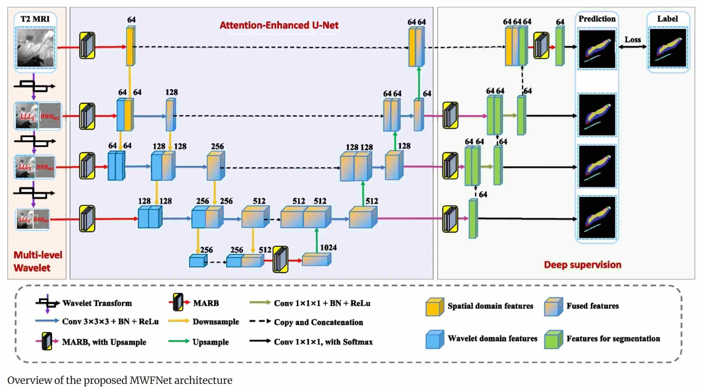

# MWFNet: A multi-level wavelet fusion network for hippocampal subfield segmentation


This is our implementation of an end-to-end neural network segmentation framework based on the PyTorch framework. It improves the accuracy of hippocampal subfield segmentation in MRI images by utilizing a multi-level wavelet fusion method.


The paper can be found in [there](https://link.springer.com/article/10.1007/s44443-025-00109-z) for  Journal of King Saud University Computer and Information Sciences.


## Prerequisites
- Linux or Windows
- Python 3
- CPU or NVIDIA GPU
- Pytorch 1.10.0


## Training
- Train the model
```bash
python train.py 
```

## Testing
- Test the segmentation
```bash
python test.py
```


## Citation
If you use this code for your research, please cite our paper.

X. Li et al., ["MWFNet: A multi-level wavelet fusion network for hippocampal subfield segmentation"](https://link.springer.com/article/10.1007/s44443-025-00109-z) in  Journal of King Saud University Computer and Information Sciences, https://doi.org/10.1007/s44443-025-00109-z


```
@article{li2025mwfnet,
  title={MWFNet: A multi-level wavelet fusion network for hippocampal subfield segmentation},
  author={Li, Xinwei and Wang, Linjin and Tao, Weijian and Meng, Hongying and Li, Haiming and He, Jiangtao and Zhao, Yue and Hu, Jun and Li, Zhangyong},
  journal={Journal of King Saud University Computer and Information Sciences},
  volume={37},
  number={5},
  pages={98},
  year={2025},
  publisher={Springer}
}
```


